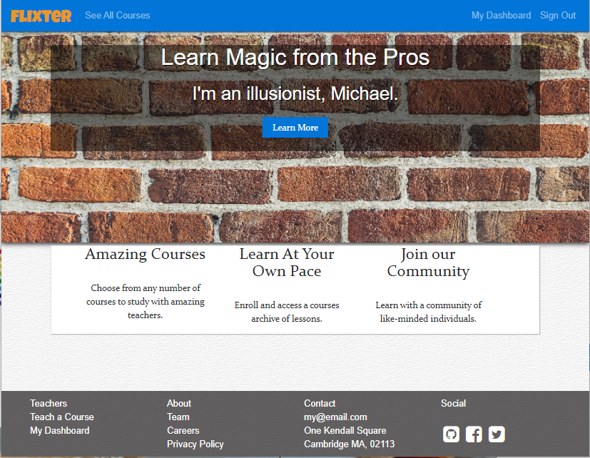
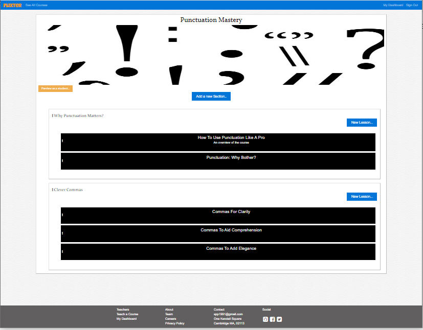
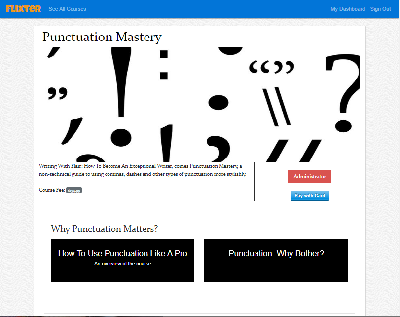
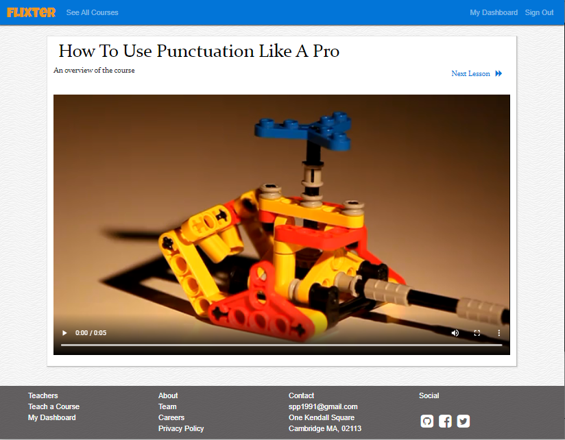
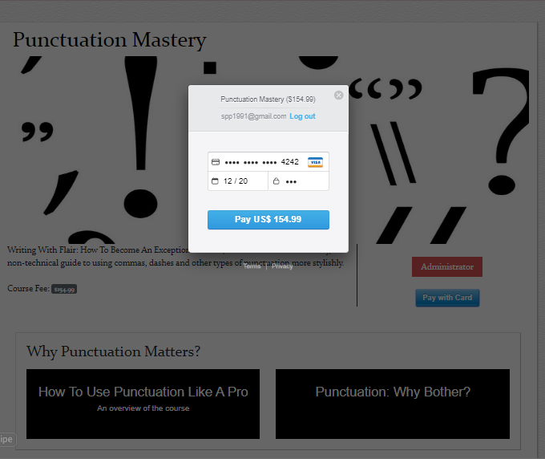

# Flixter 

A two-sided video-streaming marketplace allowing tutors to provide lessons to students for a price or even free. It features credit card payment capabilities, user role management, advanced UI and UX, and advanced database relationships, which is similar to other platforms like Udemy.

Functionalities include:
- Enabling individuals to create courses and uploading course contents (image/videos/text) for students to refer
- Allowing course creators to change the order of course contents
- Allowing students to view the course and enroll 
- Integration of feature to pay course fee via credit card 

[Try it yourself](https://flixter-sunny-patel.herokuapp.com/) 


## Getting Started

These instructions will get you a copy of the project up and running on your local machine for development and testing purposes. See deployment for notes on how to deploy the project on a live system.

### Prerequisites

You will need to setup Vagrant environment to run the application on local machine. To find the installation instructions for your OS, visit :

```
https://github.com/FirehoseProject/firehose-vagrant-rails5
```
### Installing

Initiate the vagrant environment.

Git clone the repository to your local machine in the src folder :

HTTPS:
```
$ git clone https://github.com/spp1991/flixter.git
```

SSH:

```
$ git clone git@github.com:spp1991/flixter.git
```

Open application folder created by git clone command:

```
$ cd flixter
```

Install all the gems used in application:

```
$ bundle install
```

Install the application database and create all the tables:

```
$ rails db:create
$ rails db:migrate
```

You will then be able to start the app locally by runnning:

```
$ rails server -b 0.0.0.0 -p 3000
```
The application is 


Technical details of the app is as follows :
- Programming Language: Ruby, javascript, HTML5
- Web/stylesheet Framwork : ruby on rails, bootstrap  
- Database : postgresql
- Gems : carrierwave, fog-aws
- Cloud Storage Platform : Amazon Web Service (AWS)

Note : Please execute commands to install all gems ('bundle install') and create/migrate database/tables('rails db:create , rails db:migrate') before git repository of this application is downloaded and used to run on local server 


## Home Page


## Course Listing Page (Administrator)


## Course Page (Student)


## Lesson Page (Student)


## Payment Page (Student)

